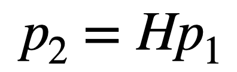

# For AI Job

## 1.传统几何相关SLAM

### 1.1旋转矩阵和四元数的关系？

旋转矩阵用9自由度描述三自由度旋转，冗余；旋转向量和欧拉角是紧凑的，但是有奇异性。

四元数是一种紧凑+非奇异表达。**三维旋转可以用单位四元数表示。**

四元数拥有一个实部+3个虚部。

### 1.2单应矩阵的作用&求解最少需要点？

单应矩阵(Homography)描述**两个平面之间的映射关系**。需要4对匹配点(八点法)。

特征点共面or纯旋转情况发生退化。

### 1.3基础矩阵&本质矩阵

F为基础矩阵，E为本质矩阵，都由对极约束定义

由于旋转平移各自有3个自由度，但同时考虑尺度不确定，因此E为5自由度。由此，说明最少需要五点来求解。但E内部为非线性性质，求解线性方程会比较麻烦，因此只考虑尺度等价性质，使用9-1=8点法求解。

八点法求解得到E后，后续可通过SVD分解得到R，t。分解时容易有4组解，但是带入深度后只会保留一组正确解。

### 1.4畸变类型

- 径向畸变(分为桶形和枕形畸变)：透镜形状导致。下文中的k。
- 切向畸变：相机组装过程透镜和成像平面没有严格平行。下文中的p。

其中，畸变模型还分为：针孔畸变模型、鱼眼畸变模型

- **针孔畸变**模型一般包含：k1，k2，p1，p2，k3.
- **鱼眼畸变**模型：鱼眼相机的设计引入了畸变，因此鱼眼相机所成影像存在畸变，其中径向畸变非常严重，因此其畸变模型主要考虑径向畸变。鱼眼模型的分析有多种多样，不详细展开，一般OpenCV用多项式模型近似表示，对于入射角theta，使用如下共识表达：

​	

参考资料：https://codeantenna.com/a/w6CmtokJwn

### 1.5Ransac

RANSAC全称：随机采样一致算法。

### 1.6高斯牛顿&LM&GL

- 高斯牛顿(Gauss Newton):将f(x)进行一阶泰勒展开，使用J.T*J作为了二阶Hessian矩阵的近似。

  

- LM：信赖区域方法。使用一下公式判断梯度的近似效果(真实下降值与梯度推导下降值之比)：

  

  当其值接近1，意味着近似效果好。当其值大于1，说明实际下降效果很好，可以放大半径，反之，缩小半径。

  LM的常用形式之一：

  

  labmda接近0时，类似高斯牛顿法，二次型近似不错；labmda变大，接近最速下降(1阶梯度)。
- Dog Leg: 以信赖域为中心。高斯牛顿法的步长在信赖域中，用高斯牛顿；最速下降的步长在信赖域之外，用归一化到信赖域的最速下降；高斯牛顿法超出信赖域，牛顿法没有超出，找到一个比例，使得两者的加权和在信赖域上。
$$
\left\{\begin{array}{ll}
\text { if }\left\|h_{g n}\right\| \leq \Delta & h_{d l}=h_{g n} \\
\text { else if }\left\|\alpha h_{s d}\right\| \geq \Delta & h_{d l}=\frac{\Delta}{\left\|h_{s d}\right\|} h_{s d} \\
\text { else } & h_{d l}=\alpha h_{s d}+\beta\left(h_{g n}-\alpha h_{s d}\right) \\
& \text { 选择 } \beta \text { 使得 }\left\|h_{d l}\right\|=\Delta
\end{array}\right.
$$

### 1.7有哪些鲁棒核函数

- Huber: $\rho(s)=\left\{\begin{array}{ll}s & s \leq 1 \\ 2 \sqrt{s}-1 & s>1\end{array}\right.$ 
- SoftLOneLoss: $\rho(s)=2(\sqrt{1+s}-1)$
- Cauchy: $\rho(s)=\log (1+s)$
- Acrtan: $\rho(s)=\arctan (s)$
- Tolerrant: $\rho(s, a, b)=b \log \left(1+e^{(s-a) / b}\right)-b \log \left(1+e^{-a / b}\right)$

### 1.8激光雷达的畸变如何产生

激光雷达畸变产生的原因：1.激光点云数据不是瞬时同时完成；2.激光点云获取时机器人正在运动。

### 1.9什么是边缘化

- [ ] TODO 补充
- Schur 消元，利用H稀疏特性，先求解路标的坐标再求解相机位姿。

### 1.10什么是ORB特征，ORB特征的旋转不变性是如何做的

ORB = Oriented Fast + BRIEF

尺度不变通过金字塔实现，旋转不变通过灰度质心实现。
### 1.11 Harris 角点
Harris角点的优点
  - 计算简单
  - 提取的点特征均匀且合理
  - 稳定：Harris算子对图像旋转、亮度变化、噪声影响和视点变换不敏感

Harris 算子的局限性
  - 对尺度很敏感，不具有尺度不变性
## 2.深度学习相关

### 2.1梯度消失&梯度爆炸

梯度消失与梯度爆炸其实是一种情况。两种情况下梯度消失经常出现，一是在**深层网络**中，二是采用了**不合适的损失函数**，比如sigmoid(sigmoid容易导致梯度消失)。

**解决方案**：1.微调+预训练；2.权重正则化；3.调整激活函数；4.BatchNorm；5.残差结构

参考资料：[详解深度学习中的梯度消失、爆炸原因及其解决方法](https://zhuanlan.zhihu.com/p/33006526)

### 2.2BatchNorm

因为深层神经网络在做非线性变换前的激活输入值（就是那个x=WU+B，U是输入）随着网络深度加深或者在训练过程中，其分布逐渐发生偏移或者变动，之所以训练收敛慢,所以这导致反向传播时低层神经网络的梯度消失，这是训练深层神经网络收敛越来越慢的.

BN就是通过一定的规范化手段，把每层神经网络任意神经元这个输入值的分布强行拉回到均值为0方差为1的标准正态分布 ，其实就是把越来越偏的分布强制拉回比较标准的分布，这样使得激活输入值落在非线性函数对输入比较敏感的区域，这样输入的小变化就会导致损失函数较大的变化,**记住“保持数据同分布”即可**。

### 2.3BatchNorm作用

### 2.4常用的Loss项

### 2.5几种常用的优化器

**SGD**：是一种使用梯度去迭代更新权重参数使目标函数最小化的方法。

**mini-batch**：小批量梯度下降算法是折中方案，选取训练集中一个小批量样本（一般是2的倍数，如32，64,128等）计算，这样可以保证训练过程更稳定，而且采用批量训练方法也可以利用矩阵计算的优势。这是目前最常用的梯度下降算法。

**随机梯度下降**：随机梯度下降算法是另外一个极端，损失函数是针对训练集中的一个训练样本计算的，又称为在线学习，即得到了一个样本，就可以执行一次参数更新。所以其收敛速度会快一些，但是有可能出现目标函数值震荡现象，因为高频率的参数更新导致了高方差。

**动量梯度下降**：引入一个指数加权平均的知识点。

**RMSprop**：更新权重的时候，使用除根号的方法，可以使较大的梯度大幅度变小，而较小的梯度小幅度变小，这样就可以使较大梯度方向上的波动小下来，那么整个梯度下降的过程中摆动就会比较小

**Adom**：Adam算法结合了Momentum和RMSprop梯度下降法，是一种极其常见的学习算法，被证明能有效适用于不同神经网络，适用于广泛的结构。

参考资料：[Deep-Learning-Interview-Book](https://github.com/amusi/Deep-Learning-Interview-Book/blob/master/docs/%E6%B7%B1%E5%BA%A6%E5%AD%A6%E4%B9%A0.md)

### 2.6常用的激活函数

sigmoid、ReLU、Tanh

## 3.NeRF相关

### 3.1NeRF如何提高图像质量

- [ ] TODO
### 3.2 Nerf 加速：
  - Instant Neural Graphics Primitives with a Multiresolution Hash Encoding
 - TensoRF: Tensorial Radiance Fields 
  - R2L
### 3.3 Unconstrained Images: 
  - Ha—Nerf
  - Nerf in the wild:  没开源，复现性能困难
### 3.4 表面重建:
 - Neus： 难以加速
 - Neural RGB-D Surface Reconstruction 
### 3.5 editable Nerf:
 - Learning Object-Compositional Neural Radiance Field for Editable Scene Rendering

### 3.6 曝光不同图片
HDR-NeRF

### 3.7 噪声
- NeRF in the dark

### 3.7 图片很少3-4张
引入先验
- pixelNeRF
- Putting NeRF on a Diet
### 3.8 图片尺度不一
- MipNeRF

### 3.9 位姿不准确
- BARF
- NeRF--
- GNeRF

### 3.10 相机畸变 
- self-calibration neural radiance field

### 3.11 模糊图片
- Deblur NeRF

